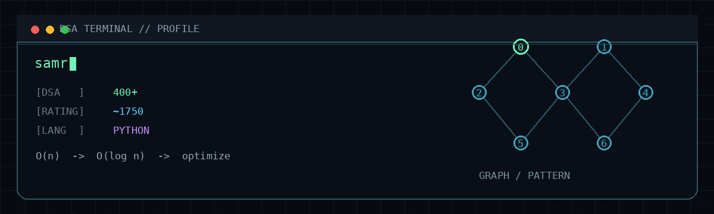

<div align="center">

<!-- ============================================================
     SAMRIDDH GUPTA — GITHUB PROFILE README
     Visual target: dark dashboard / engineering profile
     Designed for GitHub Profile README rendering.
     ============================================================ -->

<table width="100%" cellspacing="0" cellpadding="0" border="0">
<tr>
<td width="23%" valign="middle">


</td>
<td width="54%" align="center">

# <span style="color:#58A6FF">SAMRIDDH</span> <span style="color:#A371F7">GUPTA</span>

### Computer Science Student · Problem Solver · Python Developer · Backend Engineer in Progress

</td>
<td width="23%" align="right">


</td>
</tr>
</table>

<p>

&nbsp;

&nbsp;
<a href="https://www.linkedin.com/in/samriddh-gupta-990b112a1">

</a>
</p>

</div>

---

<div align="center">

<table width="100%" cellspacing="8" cellpadding="12" border="0">
<tr>

<td width="56%" valign="top">

### 🖥️ `DSA TERMINAL // PROFILE`



</td>

<td width="44%" valign="top">

### 🔥 GITHUB STREAK


<br>

### 📈 CONTRIBUTIONS


</td>

</tr>
</table>

</div>

---

<div align="center">

<table width="100%" cellspacing="0" cellpadding="8" border="0">
<tr>
<td>

### 📊 CONTRIBUTION ACTIVITY


</td>
<td width="22%" align="center">

## <span style="color:#7EE787">Let's build.</span>

**Ship. Learn. Repeat.**

</td>
</tr>
</table>

</div>

---

<h2>👤 WHOAMI</h2>

<table width="100%" cellspacing="8" cellpadding="12" border="0">
<tr>

<td width="38%" valign="middle">

I'm a Computer Science student who likes turning problems into **clean, efficient, and explainable solutions.**

I focus on **Data Structures & Algorithms, Python, and backend engineering.**

</td>

<td width="15%" align="center">

### 🧠
**THINK**  
PATTERNS

</td>

<td width="15%" align="center">

### ⚙️
**DESIGN**  
ALGORITHMS

</td>

<td width="15%" align="center">

### 📦
**BUILD**  
SYSTEMS

</td>

<td width="15%" align="center">

### ⚡
**OPTIMIZE**  
CODE

</td>

</tr>
</table>

---

<h2>🚀 WHAT I DO</h2>

<table width="100%" cellspacing="8" cellpadding="14" border="0">
<tr>

<td width="25%" valign="top">

### 🧩 DSA & PROBLEM SOLVING

Pattern recognition, complexity analysis, and optimized solutions.

</td>

<td width="25%" valign="top">

### 🗄️ BACKEND DEVELOPMENT

REST APIs, authentication, databases, and business logic.

</td>

<td width="25%" valign="top">

### ☁️ SYSTEM DESIGN THINKING

Designing scalable, reliable, and maintainable systems.

</td>

<td width="25%" valign="top">

### 💻 CLEAN & EFFICIENT CODE

Readable, testable, and production-ready code.

</td>

</tr>
</table>

---

<h2>🧩 PROBLEM SOLVING</h2>

<div align="center">

<table width="100%" cellspacing="8" cellpadding="12" border="0">
<tr>

<td align="center">

### <span style="color:#58A6FF">①</span> UNDERSTAND

Clarify the problem and constraints.

</td>

<td align="center">→</td>

<td align="center">

### <span style="color:#A371F7">②</span> RECOGNIZE

Find the pattern hiding inside.

</td>

<td align="center">→</td>

<td align="center">

### <span style="color:#F2CC60">③</span> CHOOSE

Pick the right data structure & approach.

</td>

<td align="center">→</td>

<td align="center">

### <span style="color:#7EE787">④</span> BUILD

Implement the clearest solution first.

</td>

<td align="center">→</td>

<td align="center">

### <span style="color:#FFA657">⑤</span> OPTIMIZE

Remove unnecessary work.

</td>

<td align="center">→</td>

<td align="center">

### <span style="color:#58A6FF">⑥</span> VALIDATE

Test edge cases and analyze complexity.

</td>

</tr>
</table>

</div>

---

<h2>🏗️ FEATURED PROJECTS</h2>

<table width="100%" cellspacing="8" cellpadding="14" border="0">
<tr>

<td width="50%" valign="top">

## 🚚 Smart Reverse Auction


A logistics platform where transportation providers compete for shipment requests through a reverse-auction model.

<br>

| Shipment | → | Provider | → | Bid | → | Best Value |
|---|---|---|---|---|---|---|
| Request | | Bids | | Evaluation | | Award |

<br>

`Python` · `FastAPI` · `SQLAlchemy` · `REST APIs`

</td>

<td width="50%" valign="top">

## 🎵 Moodify AI


A backend-focused application exploring mood-based interactions and personalized music experiences.

<br>

| User | → | Backend | → | Music | → | Personalized |
|---|---|---|---|---|---|---|
| Mood | | Processing | | Recommendation | | Experience |

<br>

`Python` · `FastAPI` · `Pydantic` · `SQLAlchemy` · `JWT`

</td>

</tr>
</table>

---

<h2>🛠️ TECH STACK</h2>

<table width="100%" cellspacing="8" cellpadding="12" border="0">
<tr>

<td width="50%" valign="top">

### LANGUAGES


<br><br>

**Python** · **MySQL**

### BACKEND & APIs


<br>

`REST APIs` · `JWT` · `Pydantic` · `SQLAlchemy`

</td>

<td width="50%" valign="top">

### DATABASES


<br>

**MySQL** · **PostgreSQL** · **SQLite**

### TOOLS


<br>

**Git** · **GitHub** · **VS Code** · **Postman**

</td>

</tr>
</table>

---

<h2>🎯 CURRENT FOCUS</h2>

<table width="100%" cellspacing="8" cellpadding="12" border="0">
<tr>

<td width="50%" valign="top">

### 🧭 DSA

**Solving consistently & learning deeper.**

Pattern recognition · Complexity · Optimization

</td>

<td width="50%" valign="top">

### 🛠️ PYTHON

**Writing clean, efficient code.**

Problem solving · Structure · Backend

</td>

</tr>
<tr>

<td width="50%" valign="top">

### 📦 BACKEND

**Building reliable and scalable APIs.**

REST · Authentication · Data modeling

</td>

<td width="50%" valign="top">

### 🏗️ SYSTEMS THINKING

**Understanding trade-offs & designing better systems.**

Architecture · Reliability · Failure cases

</td>

</tr>
</table>

---

<h2>🛡️ ENGINEERING PRINCIPLES</h2>

<table width="100%" cellspacing="4" cellpadding="8" border="0">
<tr>

<td width="50%">

🟢 Understand before implementing.

</td>

<td width="50%">

🟢 Choose data structures intentionally.

</td>

</tr>
<tr>

<td>

🟢 Think about complexity early.

</td>

<td>

🟢 Prefer clarity over cleverness.

</td>

</tr>
<tr>

<td>

🟢 Build projects that can be explained.

</td>

<td>

🟢 Learn by doing. Keep building.

</td>

</tr>
</table>

---

<h2>🟢 SYSTEM STATUS</h2>

<table width="100%" cellspacing="0" cellpadding="12" border="0">
<tr>

<td width="55%" valign="top">

```text
samriddh@github:~$ status --live

[+] DSA:      Solving
[+] Backend:  Building
[+] Learning: Always
[+] Goal:     Become a strong engineer

STATUS: BUILDING
```

</td>

<td width="45%" align="center">

<table width="100%" cellspacing="0" cellpadding="6" border="0">
<tr>
<td align="left">🟢 <b>DSA</b></td>
<td align="right"><code>SOLVING</code></td>
</tr>
<tr>
<td align="left">🔵 <b>Backend</b></td>
<td align="right"><code>BUILDING</code></td>
</tr>
<tr>
<td align="left">🟣 <b>Learning</b></td>
<td align="right"><code>ALWAYS</code></td>
</tr>
<tr>
<td align="left">🟡 <b>Goal</b></td>
<td align="right"><code>STRONG ENGINEER</code></td>
</tr>
</table>

</td>

</tr>
</table>

---

<h2>🐍 CONTRIBUTION LOOP</h2>

<div align="center">

<picture>
<source media="(prefers-color-scheme: dark)"
        srcset="https://raw.githubusercontent.com/samriddh009/samriddh009/output/github-contribution-grid-snake-dark.svg">
<source media="(prefers-color-scheme: light)"
        srcset="https://raw.githubusercontent.com/samriddh009/samriddh009/output/github-contribution-grid-snake.svg">

</picture>

</div>

---

<div align="center">

### Let's connect and build something amazing together. 🚀


<br><br>

**Still building. Still solving. Still learning.**

</div>

<!-- ============================================================
     OPTIONAL PERSONAL DETAILS
     Keep these here rather than cluttering the main dashboard.

     If you want the top-right illustrated developer character from
     the visual reference, add your own image as:
         ./assets/profile-character.png

     Then place it in the first table's right cell:
         

     This keeps the README reproducible instead of depending on an
     unknown third-party image host.
     ============================================================ -->

<!-- ============================================================
     GITHUB RENDERING NOTES
     ------------------------------------------------------------
     1. GitHub profile READMEs support GitHub Flavored Markdown and
        HTML, including tables and images.
     2. Relative image paths such as ./dsa_terminal_profile.gif work
        when the asset exists in this profile repository.
     3. External statistic cards are intentionally isolated so a
        failed third-party endpoint does not destroy the layout.
     4. The contribution snake requires the generated SVG files in
        the output branch.
     5. Run the snake workflow manually once after adding the workflow.
     ============================================================ -->
